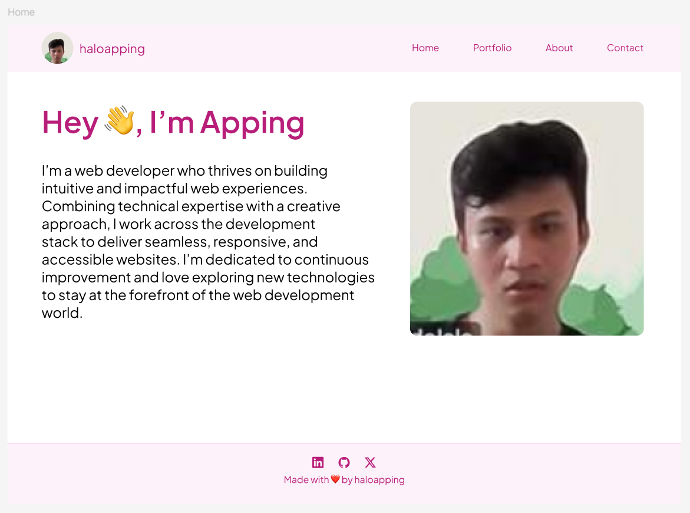
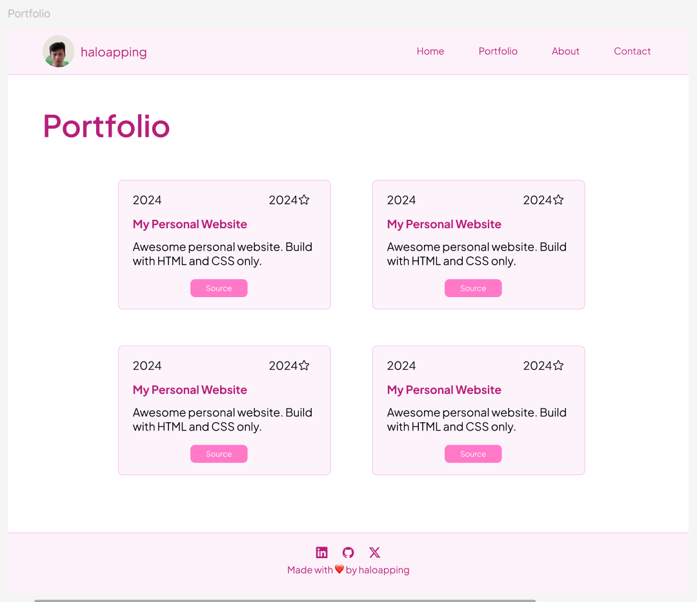
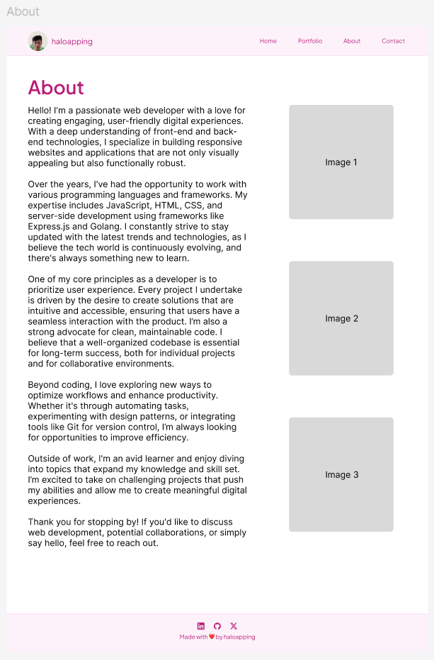
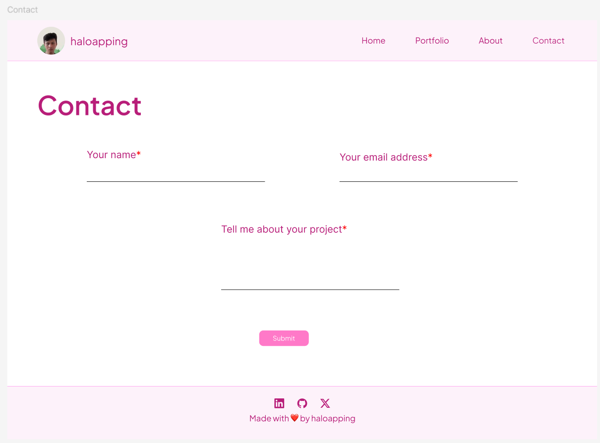

# Hi👋, I'm [haloapping](haloapping.com)

My personal webpage **_showcases projects, blog posts, and insights into my journey as a web developer_**. It's a space where I share my skills, learnings, and experiments with web technologies.

> Note: website in progress btw 😁

## Links

- [UI Design](https://www.figma.com/design/QXV60ahwwv6cszD10B5QCV/haloapping.com?node-id=0-1&t=7tL5BIBDNvpqwVDd-1)
- [Github Repository](https://github.com/haloapping/haloapping.com)

## Tools

- [Figma](https://www.figma.com/) for UI design.
- [VSCode](https://code.visualstudio.com/) for text editor.

## UI Design Preview

Inspired by [Tania Rascia's](https://www.taniarascia.com/) personal website.

### Home

### Portfolio

### About

### Contact

## Social Media

- [Linkedin](https://www.linkedin.com/in/haloapping/)
- [Twitter](https://x.com/haloapping)
- [GitHub](https://github.com/haloapping)

Made with ❤️ by [haloapping](haloapping.com)
